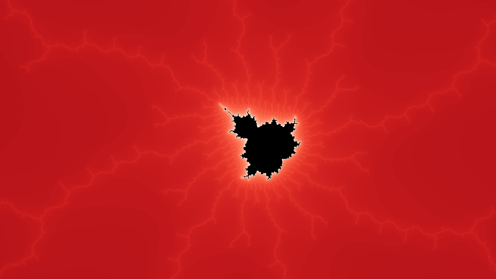

<div align="center">

# mandelbrot
CLI mandelbrot set plotting tool


</div>


# Usage
This is a CLI tool to plot the [Mandelbrot set](https://en.wikipedia.org/wiki/Mandelbrot_set)
```
$ mandelbrot --position=island --width=1920 --height=1080 --colormap=rainbow
```

# Images



